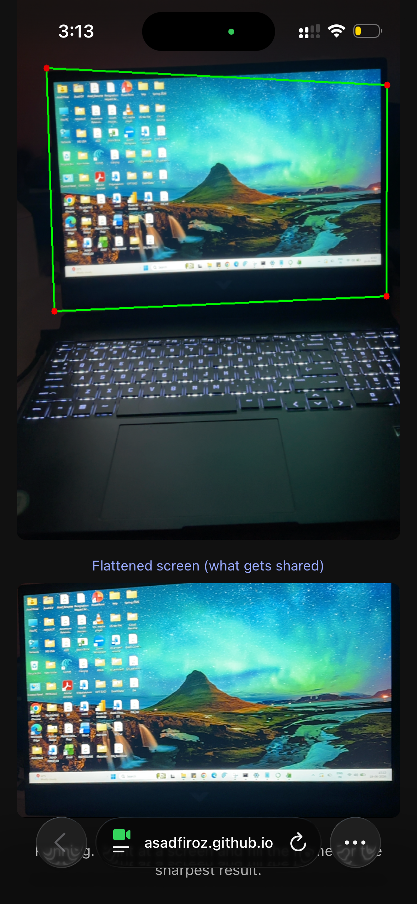

# Screen Share via Phone Camera

A browser based tool that points your phone camera at a laptop or computer screen,
detects the screen, flattens it to a straight on view, and sharpens it. The goal is
to let you show your screen to someone (a mentor, a teammate, an advisor) in
situations where normal screen sharing tools are blocked or not available.

Live demo: https://asadfiroz.github.io/screen-share-pipeline/

(Open it on a phone, allow the camera, and point the back camera at a screen.)

## Problem statement 

Remote collaboration depends heavily on screen sharing, yet screen sharing is often
unavailable. Corporate security policies, locked down or air gapped machines,
examination settings, and legacy systems frequently block or do not support it. In
these cases the only practical way to show a screen to a remote person is to capture it
optically with a second device, such as a phone camera. An optical capture of a display
is degraded by perspective distortion, variable lighting and glare, motion blur, and
limited resolution, which makes the content hard to read.

This project studies real time detection and rectification of a display surface from a
handheld camera, performed entirely on device in a web browser, with no installed
software and no server. The core technical task is to localize the four corners of a
screen in a camera frame and then apply a homography that maps the screen to a flat,
head on, readable view.

## Approach and contributions

- A fully client side, server free pipeline: camera capture, screen corner detection,
  homography based rectification, and image enhancement, all running in the browser.
- A small corner regression convolutional network exported to ONNX and run in the
  browser with WebAssembly, so no specialized hardware or app install is needed.
- A two part data strategy: a procedural generator that renders synthetic laptop scenes
  with exact corner labels, and an auto labeling method that reuses a classical detector
  to label real photographs with no manual annotation.

This problem is related to document image rectification and quadrilateral document
detection used in mobile document scanners. Screens differ from documents because they
emit light, show arbitrary and changing content, have bezels, and produce glare and
reflections, which motivates a learned detector built specifically for screens.

## How it works (the pipeline)

The app runs the same five steps on every camera frame:

1. Capture a live frame from the phone camera.
2. Detect the four corners of the screen.
3. Flatten the screen using a perspective transform so it looks straight on.
4. Sharpen the flattened image.
5. Show the result.

Only step 2 (detecting the screen) changed as the project grew. Everything around it
stayed the same.

## Two ways to detect the screen

### Version 1: Classical computer vision

The first version used classical image processing: find edges, find shapes, and keep
the largest four sided shape. This works well when the screen is bright and fills the
frame, but it fails on busy backgrounds, on a plain desktop wallpaper, and when other
rectangles (windows, picture frames) are in view, because it only looks at edges and
has no real idea of what a screen is.

### Version 2: Machine learning model (current)

The current version uses a small neural network that looks at the image and predicts
the four screen corners directly. It learns the shape of a screen rather than its
content, so it handles many more situations than the classical method.

## The model

- Input: a 256 x 256 image.
- Output: 8 numbers, which are the x and y of the four corners.
- A small convolutional neural network (CNN) built in PyTorch.
- Exported to the ONNX format and run directly in the browser using ONNX Runtime Web,
  so no server is needed.

## Training data

The model was trained on two kinds of data:

1. Synthetic data: a Python script builds thousands of fake laptops (a screen with a
   bezel and a keyboard) placed on real room photos at different sizes and angles.
   Because the script creates the screen, it knows the exact corner positions, so the
   labels are free and accurate.
2. Real data: a separate capture page uses the older classical detector to auto label
   real photos of an actual screen. When the classical detector locks on, it saves the
   photo and the corners it found. This gave a few hundred real, correctly labeled
   images with almost no manual work.

The model was trained on both sets combined, which made it work much better on real
screens than synthetic data alone.

## How the model was trained (steps I followed)

You will need: pip install opencv-python numpy pillow-heif (PyTorch is already installed in Google Colab).

1. Generate synthetic data: put screenshots in a content/ folder and room photos in
   a backgrounds/ folder, then run python generate_data.py. This builds thousands of
   labeled fake-laptop images.
2. Collect real data: open capture.html on a phone, point at a real screen, and tap
   Capture whenever the outline locks on. The old classical detector auto labels each
   shot. Download the result as real_dataset.zip.
3. Train: in Google Colab (free GPU), upload the synthetic and real data and run
   train_v2.py. It trains the corner-detection model and exports screen_corners.onnx.
4. Deploy: put screen_corners.onnx next to index.html in this repo. The app loads it
   automatically.

## Tech stack

- App and inference: HTML, JavaScript, OpenCV.js (for the warp and sharpen),
  ONNX Runtime Web (to run the model).
- Training: Python, PyTorch, OpenCV, NumPy, on a free Google Colab GPU.
- Hosting: GitHub Pages (free static hosting with HTTPS, which the camera needs).

## How to use it

1. Open the demo link above on your phone.
2. Allow camera access.
3. Point the back camera at a screen.
4. A green outline appears on the detected screen, and the lower view shows the
   flattened, straightened version.

## Files in this repository

- `index.html` : the live app (camera, model, flatten, sharpen).
- `capture.html` : tool used to collect and auto label real training images.
- `generate_data.py` : creates the synthetic training data.
- `train.py`, `train_v2.py` : model training scripts.
- `screen_corners.onnx` : the trained model used by the app.
- `step1_capture.py`, `step2_detect.py` : the original Python
  prototype (classical detection) before the browser version.
- `requirements.txt` : Python packages for the prototype.

## Screenshots

Screen detected and outlined:

## Current status

What works:
- Detects and flattens a screen when it fills the frame fairly head on.
- Runs fully in the browser on a phone, no app install and no server.
- Trained on a mix of synthetic and real data.

Known limitations:
- The corners can drift on some angles, sometimes including part of the keyboard.
- It can still draw a box on a busy non screen scene, because the current model does
  not yet output a "screen present" confidence.

## Future work & Research

- Screen presence and confidence: add a presence output so the model reports a
  probability that a screen is in view, and study how to set the threshold to balance
  false detections against missed detections.
- Closing the sim to real gap: grow the real data set across more devices, screen
  contents, distances, angles, and lighting, and measure how accuracy scales with the
  amount and diversity of real data versus synthetic data.
- Architecture study: compare the current small network against a pretrained backbone
  such as MobileNet, and against a segmentation based formulation, trading off accuracy
  against on device latency.
- Temporal modeling: use information across frames, such as tracking and smoothing, to
  improve stability instead of treating each frame independently.
- Robustness: evaluate and improve performance under glare, reflections, partial
  occlusion, and multi monitor setups.
- Evaluation protocol: define a held out real test set and report standard metrics such
  as normalized corner localization error, intersection over union of the rectified
  region, precision and recall for screen presence, and end to end latency on mobile
  hardware.
- Readability and enhancement: study super resolution and deblurring on the rectified
  output to recover small text, and measure the readability gains.

## Note

This is a work in progress prototype built as a learning and portfolio project. It is
actively being improved.
